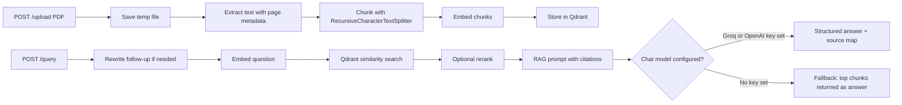

# RAG Knowledge Assistant

FastAPI backend for PDF ingestion, chunking, semantic retrieval, and cited answer generation with LangChain and Qdrant. Answer generation runs on Groq (LLaMA 3.3 70B) by default, with OpenAI as an optional fallback.

## Architecture



## Endpoints

- `POST /upload`: upload one PDF and index it
- `POST /query`: ask a question against one or more uploaded PDFs
- `GET /documents`: list uploaded documents and chunk counts
- `GET /health`: service health check

## Answer generation

`generate_answer()` builds a context-grounded prompt from the top retrieved chunks and asks the chat model for a structured response (`answer` + `citations`), using `with_structured_output`. Citations are returned as `(source_file, page_number)` pairs and mapped back to a snippet of the original chunk text for the `Sources` panel.

If no chat model is configured (no `GROQ_API_KEY` or `OPENAI_API_KEY` set), the service does **not** fail — it falls back to returning the top retrieved chunks directly as a bulleted "answer," still with citations attached. This keeps the API usable for testing retrieval quality in isolation, but it is not a substitute for real generation — always confirm `GROQ_API_KEY` is set for demos so responses are actual synthesized answers, not raw chunk dumps.

## Trade-offs

- Collection-per-document gives stronger isolation and simpler deletion.
- Shared collection with `source_file` filtering makes multi-document queries easier and is the default here.
- Chunk size starts at roughly 700 characters with 100 character overlap; tune this after a few manual evals.
- Optional cross-encoder reranking (`RERANK_ENABLED=true`) trades a small latency cost for better top-k ordering on ambiguous queries; falls back to keyword-overlap ranking if `sentence-transformers` isn't available.

## Run

1. Create or activate the virtual environment in `.venv`.
2. Install dependencies:

```bash
python -m pip install -e .[dev]
```

3. Set up environment variables. Create a `.env` file in the project root:

```
GROQ_API_KEY=your_groq_key_here
```

Get a free key at [console.groq.com](https://console.groq.com). If `GROQ_API_KEY` is not set, the service checks for `OPENAI_API_KEY` next; if neither is present, it runs in retrieval-only fallback mode (see above).

4. Start the API:

```bash
uvicorn rag_knowledge_assistant.api.main:app --reload
```

## Configuration reference

| Variable | Default | Notes |
|---|---|---|
| `GROQ_API_KEY` | none | Primary chat model backend (LLaMA 3.3 70B) |
| `OPENAI_API_KEY` | none | Fallback chat model backend (gpt-4o-mini) |
| `EMBEDDING_PROVIDER` | `local` | `local` uses `sentence-transformers/all-MiniLM-L6-v2`; set to `openai` for `text-embedding-3-small` |
| `QDRANT_PATH` | `storage/qdrant` | Set to disable/change on-disk persistence |
| `RERANK_ENABLED` | `false` | Enables cross-encoder reranking of retrieved chunks |
| `CHUNK_SIZE` / `CHUNK_OVERLAP` | `700` / `100` | Tune based on document density |

## Notes

- The default embedding backend uses `sentence-transformers/all-MiniLM-L6-v2` for demos and requires no API key.
- Switch to OpenAI embeddings by setting `EMBEDDING_PROVIDER=openai` and `OPENAI_API_KEY`.
- Qdrant runs in-memory unless `QDRANT_PATH` is set (default here persists to `storage/qdrant`).
- Never commit `.env` — keep a `.env.example` with placeholder values instead for anyone cloning the repo.