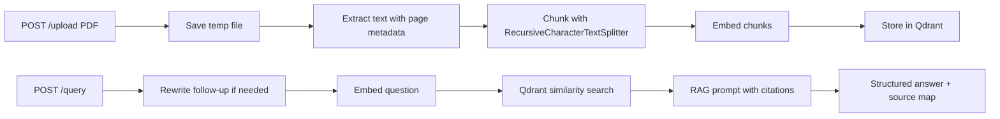

# RAG Knowledge Assistant

FastAPI backend for PDF ingestion, chunking, semantic retrieval, and cited answer generation with LangChain and Qdrant.

## Architecture



## Endpoints

- `POST /upload`: upload one PDF and index it
- `POST /query`: ask a question against one or more uploaded PDFs
- `GET /documents`: list uploaded documents and chunk counts
- `GET /health`: service health check

## Trade-offs

- Collection-per-document gives stronger isolation and simpler deletion.
- Shared collection with `source_file` filtering makes multi-document queries easier and is the default here.
- Chunk size starts at roughly 700 characters with 100 character overlap; tune this after a few manual evals.

## Run

1. Create or activate the virtual environment in `.venv`.
2. Install dependencies:

```bash
python -m pip install -e .[dev]
```

3. Start the API:

```bash
uvicorn rag_knowledge_assistant.api.main:app --reload
```

## Notes

- The default embedding backend uses `sentence-transformers/all-MiniLM-L6-v2` for demos.
- Switch to OpenAI embeddings by setting `EMBEDDING_PROVIDER=openai` and `OPENAI_API_KEY`.
- Qdrant runs in-memory unless `QDRANT_PATH` is set.
